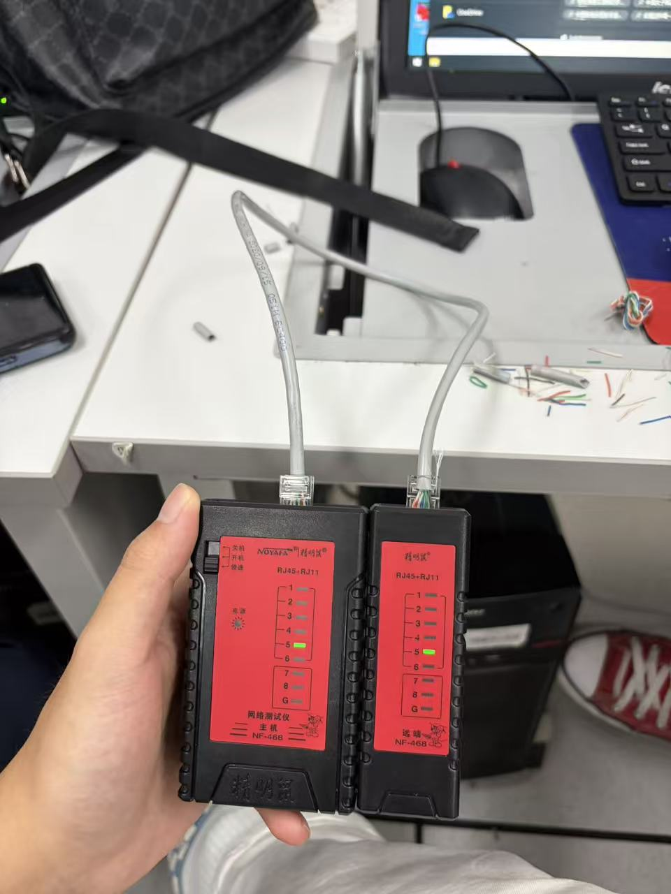

# 计算机网络物理层学习笔记

**定位**：物理层是计算机网络五层模型的**最底层**，是所有网络通信的基础，直接面向硬件设备，负责原始比特流的透明传输，不处理数据含义、不纠错、不路由。

**核心宗旨**：屏蔽各类物理设备、传输介质、通信接口的差异，让上层数据链路层只需关注数据帧传输，无需关心底层硬件细节。

## 一、物理层核心定义与四大特性

物理层的功能通过**四大电气/物理特性**规范统一，是考试和实操核心考点。

### 1. 机械特性

定义硬件接口的物理外观参数，规范设备的物理连接方式。

包含内容：接口形状、尺寸、引脚数量、引脚排列顺序、固定方式等。

举例：网线 RJ45 接口、串口 RS-232 接口的引脚规格。

### 2. 电气特性

定义传输信号的电气参数，规范比特流的电压、电流标准。

包含内容：信号电压范围、传输速率、最大传输距离、阻抗匹配等。

核心规则：明确什么电压代表二进制 0、什么电压代表二进制 1。

### 3. 功能特性

定义接口每个引脚的具体功能和信号类型。

包含内容：引脚对应数据信号、控制信号、时钟信号、接地信号等。

举例：RJ45 网线 1/2 引脚发送数据、3/6 引脚接收数据。

### 4. 规程特性（过程特性）

定义设备通信的时序规则和操作流程，即物理层的工作顺序。

包含内容：设备上电、信号发送、信号接收、链路断开的时序逻辑。

举例：通信双方先同步时钟，再传输比特流，传输结束后释放链路。

## 二、物理层核心功能

- **比特流透明传输**：唯一核心数据功能，将上层帧数据拆解为 0/1 比特流，通过物理介质传输，不修改、不解析数据内容。
- **物理链路建立、维持、释放**：负责通信链路的接通、持续通信、断开的全过程管控。
- **信号传输与同步**：实现电信号/光信号的收发，保障收发双方时钟同步。
- **屏蔽硬件差异**：统一不同介质、设备的通信标准，为上层提供统一服务接口。

**重点误区**：物理层**无差错校验、无重传机制、无流量控制**，出错直接丢弃，纠错交由上层协议处理。

## 三、数据通信基础核心概念

### 1. 信号分类

#### （1）模拟信号 & 数字信号

- **模拟信号**：连续变化的电/光信号，波形平滑，易受干扰、失真不可逆，用于传统电话、广播。
- **数字信号**：离散突变的 0/1 脉冲信号，抗干扰能力强、失真可修复，计算机网络通用信号。

#### （2）基带信号 & 带通信号

- **基带信号**：数字信号直接传输，无需调制，近距离传输（网线、局域网），成本低、速度快。
- **带通信号**：基带信号调制到高频载波上，远距离传输（光纤、无线、广域网），抗干扰更强。

### 2. 通信方式分类

#### （1）按传输方向划分

- **单工通信**：单向传输，一方只发、一方只收，无反向通道。例：广播、电视。
- **半双工通信**：双向传输，但同一时间只能单向发送，收发切换。例：对讲机、传统集线器网络。
- **全双工通信**：双向同时收发，互不干扰。例：现代交换机网线、手机通话、光纤通信（主流网络通信方式）。

#### （2）按传输时序划分

- **串行传输**：比特流逐位依次传输，线路少、成本低，适合远距离（网线、光纤）。
- **并行传输**：多位比特同时传输，速度快、线路多，易串扰，仅适合短距离（计算机内部总线）。

### 3. 速率与带宽核心公式

**码元**：数字通信中承载信息的基本波形单元，一个码元可携带多个比特信息。

**码元传输速率（波特率）**：单位时间内传输的码元个数，单位：波特（Baud），只和波形变化频率有关，与比特数无关。

**信息传输速率（比特率）**：单位时间传输的比特数，单位：bit/s。

**核心换算公式**：比特率 = 波特率 × log₂N（N 为码元的离散电平数）。

**带宽**：信道最高数据传输速率，单位 bit/s，是信道极限传输能力，实际速率低于带宽。

## 四、信道复用技术（高频考点）

复用核心目的：多条通信链路共享一条物理信道，提升信道利用率、降低成本。

### 1. 频分复用 FDM

将信道频率划分为多个子频段，每个子频段独立传输一路信号，所有信号**同时传输**、占用不同频率。

特点：模拟信号复用，无需同步，适合广播、有线电视；子信道带宽固定，灵活性差。

### 2. 时分复用 TDM

将时间划分为固定时隙，各路信号轮流占用时隙传输，**同一频率、不同时间**。

特点：数字信号复用，同步时分复用固定分配时隙，无数据也占用时隙，存在资源浪费；是局域网、移动通信主流技术。

### 3. 统计时分复用 STDM

TDM 改进版，动态分配时隙，有数据的设备占用时隙，无数据则不分配，**提升信道利用率**。

区别：STDM 按需分配，无资源浪费，需要地址标识区分数据来源。

### 4. 波分复用 WDM

光信号的频分复用，在一根光纤中同时传输不同波长的光载波信号。

特点：光纤通信核心技术，传输容量极大、损耗极低、抗干扰强，骨干网络通用。

### 5. 码分复用 CDM

通过不同编码区分多路信号，各路信号**同时、同频率**传输，接收端通过编码解码区分数据。

应用：4G/5G 移动通信、卫星通信。

## 五、常见物理传输介质

### 1. 双绞线（局域网主流）

由 4 对缠绕铜线组成，缠绕设计减少电磁串扰，分为屏蔽双绞线（STP）和非屏蔽双绞线（UTP）。

常用规格：超五类、六类网线，最大传输距离 **100 米**，近距离、低成本、易部署。

### 2. 光纤（骨干网、远距离传输）

以光信号传输数据，分为单模光纤（长距离、高速率）和多模光纤（短距离）。

核心优势：传输距离远、带宽极大、抗电磁干扰、无信号泄露、保密性强。

### 3. 无线介质

通过电磁波传输，包括 WiFi、蓝牙、5G、微波、卫星通信。

特点：无需布线、灵活便捷，缺点是易受遮挡、干扰，稳定性低于有线传输。

## 六、物理层典型设备

### 1. 中继器

信号再生放大设备，解决信号传输衰减问题，对失真信号整形、放大、转发。

规则：仅转发比特流，不解析数据，无过滤功能；以太网中最多串联 4 个中继器。

### 2. 集线器（HUB）

多端口中继器，共享同一物理信道，属于**共享式设备**。

特点：所有端口同一冲突域、同一广播域，半双工通信，带宽共享，现已被交换机淘汰。

### 3. 光纤收发器、光模块

实现光电信号转换，适配光纤与网线设备对接，广泛用于园区网、骨干网。

## 七、重点易错知识点总结

- 物理层传输单位：**比特（bit）**；数据链路层传输单位是帧，切勿混淆。
- 四大特性区分：机械看外观接口、电气看信号参数、功能看引脚作用、规程看通信时序。
- 波特率 ≠ 比特率：波特率看码元数量，比特率看数据量，码元进制越高，单码元携带比特越多。
- 集线器是物理层设备，交换机是数据链路层设备，路由器是网络层设备（层级必考区分）。
- 双绞线极限传输距离 100 米，超距信号严重衰减，需中继设备延伸。
- 物理层不纠错、不重传、不控流，所有数据差错交由上层处理。
- 全双工无冲突，半双工存在信号冲突，单工无双向通信能力。

## 八、知识框架思维导图（精简版）

物理层 → 四大特性（机械/电气/功能/规程）→ 核心功能（比特传输、链路管控）→ 数据通信（信号/通信方式/速率带宽）→ 信道复用（FDM/TDM/STDM/WDM/CDM）→ 传输介质（双绞线/光纤/无线）→ 物理设备（中继器/集线器）→ 易错考点

## 九、物理层实验

### 实验一：双绞线的使用

**实验目的**：掌握双绞线（网线）的结构与线序标准，学会 RJ45 水晶头的制作方法，并能使用网线测试仪检测双绞线的连通性与线序是否正确。

**实验器材**

- 非屏蔽双绞线（UTP，超五类/六类）一段
- RJ45 水晶头 2 个
- 压线钳（网线钳）
- 网络测试仪 NF-468（主机 + 远端）

**实验步骤**

1. 剥线：用压线钳剥去双绞线外皮约 2 cm，露出 4 对共 8 根芯线，注意不要损伤芯线绝缘层。
2. 理线：按 T568B 标准（橙白、橙、绿白、蓝、蓝白、绿、棕白、棕）将 8 根芯线排列整齐并捋直。
3. 剪线：将芯线端头剪齐，保留长度约 1.2～1.5 cm，保证插入水晶头后铜芯能顶到最前端。
4. 插头：把芯线按线序插入 RJ45 水晶头，从水晶头前端确认颜色顺序正确、8 根线均顶到底。
5. 压接：将水晶头放入压线钳槽口压紧，使金属片刺破绝缘层并与铜芯可靠接触。
6. 测线：双绞线一端接入测试仪主机、另一端接入远端，开机后观察两侧指示灯的亮灯顺序。

**实验现象**：将制作好的双绞线两端分别接入测试仪主机与远端，开机后两侧指示灯逐芯同步扫描。照片记录的是扫描过程中的一个瞬间：主机与远端**5 号指示灯同时亮起绿光**，其余灯位未亮。两侧亮灯序号完全对应，说明第 5 芯导通、两端线序一一对应；只有 1～8 号灯（屏蔽线另含 G 灯）全部依次同步点亮，才能判定 8 根芯线全部导通且线序正确、网线制作合格。若某一序号一侧亮一侧不亮，说明对应芯线断路或接触不良；若两侧亮灯序号错乱、互不对应，说明两端线序标准不一致或线序接错，需剪掉水晶头重新压接。

**实验结论**：双绞线是物理层最常用的传输介质，其连通性取决于正确的线序和可靠的压接工艺。本次测试中主机与远端的亮灯序号同步对应，表明所测芯线导通、两端线序一致；但单次抓拍的瞬间只能证明当前扫描到的那根芯线正常，制作完成后仍应完整观察 1～8 号灯（屏蔽线另含 G 灯）是否全部依次同步点亮，确认 8 根芯线全部导通，网线才能稳定工作。双绞线单段最大传输距离为 100 米，超过该距离信号严重衰减，需要中继设备延伸。

**注意事项**

- 剥外皮时不可划伤芯线绝缘层，否则容易造成短路或断线。
- 两端水晶头必须使用同一线序标准（T568A 或 T568B），两端标准不一致会导致线序测试错乱。
- 压接后轻拉网线，确认水晶头不松动、不脱落。
- 测线时可使用慢速档，便于观察指示灯的亮灯顺序，快速档扫过快容易漏看。